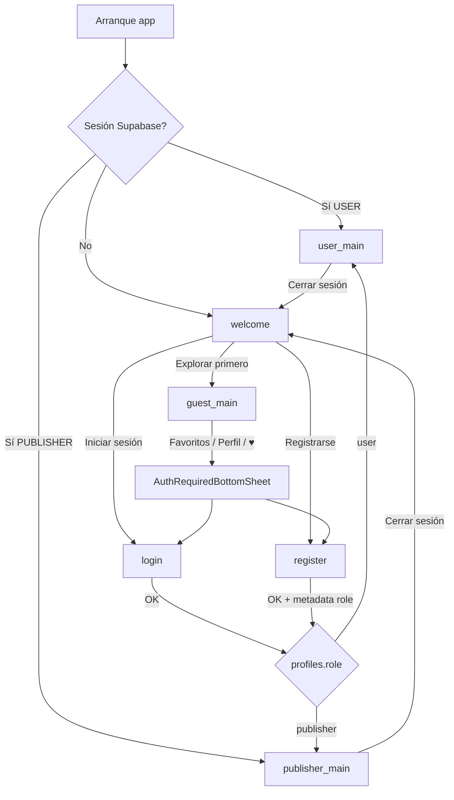

# Fase 3 — Flujo de autenticación y sesión

## Diagrama de flujo



## AppSession

| Estado | Descripción |
|--------|-------------|
| `Guest` | Sin sesión Supabase; exploración permitida |
| `Authenticated(USER)` | Espectador; grafo `user_main` |
| `Authenticated(PUBLISHER)` | Publicador; grafo `publisher_main` |

El invitado **no** existe en PostgreSQL. Solo `profiles.role` ∈ `user`, `publisher`.

## Metadata en registro

En `signUp`, la app envía `raw_user_meta_data`:

```json
{
  "role": "user",
  "display_name": "Opcional"
}
```

Valores exactos para el trigger `handle_new_user`:

- Espectador → `"user"`
- Publicador → `"publisher"`

Tras el signup, el rol de navegación se confirma con `SELECT` en `profiles` (fuente de verdad).

## Pruebas manuales

1. **BuildConfig:** `local.properties` con `supabase.url` (base del proyecto, sin `/rest/v1`) y `supabase.anon.key`.
2. **Explorar primero:** Welcome → Explorar primero → `guest_main` sin login.
3. **Bottom sheet:** En invitado, pestañas Favoritos/Perfil o icono ♥ → sheet con Login / Registro.
4. **Login seed:** `user1@test.livent` / contraseña del seed → `user_main`.
5. **Login publisher:** `publisher1@test.livent` → `publisher_main`.
6. **Registro:** Nuevo email + rol Publicador → verificar fila en `profiles` en Supabase Dashboard.
7. **Persistencia:** Login → cerrar app → reabrir → entra directo al grafo del rol.
8. **Sign out:** Perfil (user) o Publisher → Welcome.

## Fuera de alcance (Fase 3)

- CRUD de eventos, favoritos en BD, Stripe, subida de carteles.
- UI pixel-perfect de mockups (Fase 7).
