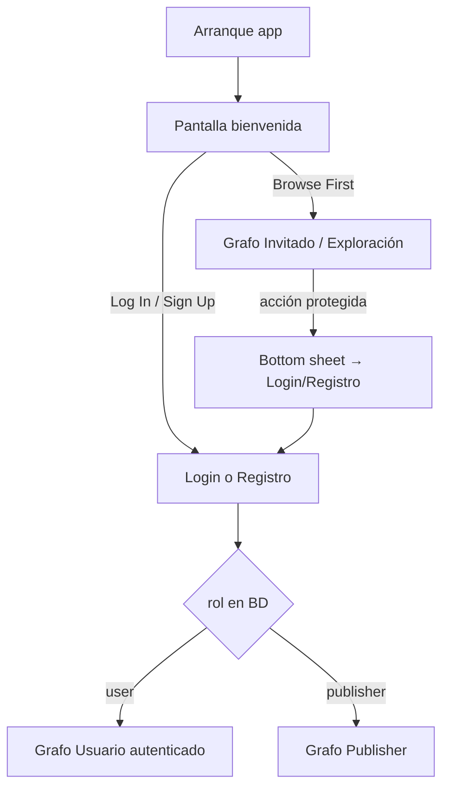

# Proyecto Livent: Plan de Arquitectura y Lógica de Negocio

El objetivo de este documento es establecer la hoja de ruta definitiva para el desarrollo de la aplicación Android "Livent", tomando como base tu documento `plan1.md` y definiendo el comportamiento exacto de los perfiles, la sesión de invitado y la monetización.

## User Review Required

> [!IMPORTANT]
> Revisa detenidamente las propuestas de **Lógica de UI/UX**, el **modo Invitado** y la **Estrategia de Monetización**. Los mockups de referencia (`Livent_UI1.jpg`, `Livent_UI2.jpg`) definen el objetivo visual de la Fase 7 y de las pantallas de Usuario/Invitado.

---

## 1. Revisión de "plan1.md"

El `plan1.md` está **excelentemente planteado**. El stack tecnológico elegido (Supabase, Jetpack Compose, Clean Architecture, Hilt) es el estándar de la industria actual. Usar este stack te asegura no solo una nota sobresaliente por su modernidad y robustez, sino que te prepara perfectamente para el mundo laboral.

Todo en el plan original es válido. Las propuestas de UI y funciones se han aterrizado en las secciones siguientes, incluyendo el acceso sin registro (Invitado).

---

## 2. Modelo de sesión y perfiles

### 2.1 Sesión de aplicación (capa dominio)

El **Invitado no es un rol en base de datos**. Es el estado de la app cuando **no hay sesión Supabase activa**.

```text
AppSession
├── Guest          → sin auth; navegación de exploración
└── Authenticated  → con auth; rol leído de profiles.role
    ├── UserRole.USER
    └── UserRole.PUBLISHER
```

*   En PostgreSQL solo existen roles `user` y `publisher` en la tabla de perfiles.
*   En Kotlin: `UserRole` (USER | PUBLISHER) + `AppSession` (Guest | Authenticated).

### 2.2 Flujo de arranque y navegación



**Regla clave:** Tras **login o registro exitoso**, la navegación **cambia según el rol** (`user` → grafo espectador; `publisher` → grafo publicador). Esto se mantiene igual que en el plan original.

El Invitado **comparte el grafo visual de exploración** con el Usuario autenticado (feed, detalle de evento, búsqueda). Lo que cambia es el **acceso a acciones que requieren cuenta**, no el diseño del descubrimiento.

### 2.3 Perfil: Invitado (sin registro)

**Objetivo:** Descubrir eventos sin fricción; convertir a registro solo cuando intente una acción personal.

*   **Entrada:** Pantalla de bienvenida → enlace **"Browse First"** (equivalente Livent al mockup de onboarding en `Livent_UI2.jpg`).
*   **Puede (sin login):**
    *   Ver **Home / Descubrimiento** (carrusel de destacados + listado de eventos activos).
    *   Ver **detalle de evento** (solo lectura).
    *   Usar **búsqueda y filtros** de exploración (si están implementados en el feed).
*   **No puede (dispara Bottom Sheet, no navega a la pantalla):**
    *   Pestaña o acción **Favoritos** (guardar o ver lista).
    *   Pestaña o acción **Perfil / Cuenta**.
    *   Pulsar **corazón / añadir a favoritos** en listado o detalle.
    *   Cualquier acción de **Publisher** (publicar, dashboard, Stripe).
*   **Bottom Sheet de acceso restringido (obligatorio):**
    *   Se muestra al intentar cualquier acción anterior.
    *   Contenido mínimo: título breve (“Inicia sesión para continuar”), texto explicativo, botones **Iniciar sesión** y **Registrarse** (y opcional **Cancelar**).
    *   No sustituye la pantalla de Favoritos/Perfil; **intercepta el gesto** y mantiene al usuario en el contexto actual (feed o detalle).
*   **Bottom Navigation (Invitado y Usuario):** 3 pestañas — **Inicio**, **Favoritos**, **Perfil** — con el mismo estilo visual que los mockups, pero Favoritos/Perfil en invitado solo abren el Bottom Sheet.

### 2.4 Perfil: Usuario (Espectador autenticado)

**Objetivo:** Descubrimiento inmersivo y retención mediante Favoritos.

*   **UI/UX:** Clones visuales de los mockups adaptados a Livent (ver sección 6).
    *   **Home (Descubrimiento):** Carrusel de “Eventos Destacados” + grid/lista de próximos eventos por fecha. Estilo: cards redondeadas, acento rosa/magenta, barra de búsqueda, chips de categoría (referencia `Livent_UI2.jpg`).
    *   **Bottom Navigation:** Inicio | Favoritos | Perfil (referencia navegación inferior de los mockups, **sin** pestañas Ticket/Carrito/Puntos del diseño original de eventos con venta de entradas).
    *   **Favoritos:** Lista con estados vacío y con datos; diálogo de confirmación al eliminar (referencia `Livent_UI1.jpg` — pantallas “Favorite events”).
    *   **Perfil / Cuenta:** Cabecera con avatar, nombre, email; ajustes agrupados (referencia `Livent_UI1.jpg` — pantalla “Account”). **Sin** sección de puntos/vouchers del mockup (no aplica a Livent).
    *   **Detalle del evento:** Imagen superior, textos claros, botón de favorito con animación; favorito persiste en BD.
*   **Lógica funcional:**
    *   Consulta de eventos activos (lectura).
    *   CRUD de favoritos: relación `user_id` ↔ `event_id` en BD (RLS `authenticated`).

### 2.5 Perfil: Publisher (Publicador de eventos)

**Objetivo:** Gestión eficiente de sus eventos y monetización.

*   **UI/UX:** Grafo **distinto** al del Usuario/Invitado (no clonar el feed de descubrimiento como pantalla principal).
    *   **Dashboard (Inicio):** 3 tarjetas de estadísticas + lista de sus eventos (Activo/Pasado).
    *   **Creación de evento:** Asistente **paso a paso** (decisión del usuario; no pantalla única con scroll).
    *   **Menú/Perfil:** Cuenta + acceso a suscripción Premium (Stripe).
*   **Lógica funcional:**
    *   CRUD solo de *sus* eventos (RLS).
    *   Subida de carteles a Supabase Storage.
    *   Validación de límite del plan Free antes de crear otro evento activo → Bottom Sheet de upgrade (Fase 6).

---

## 3. Estrategia de monetización propuesta

1.  **Usuarios finales (rol `user`):** 100 % gratis.
2.  **Publishers — Plan Free (por defecto):**
    *   **1 evento activo** simultáneo.
    *   Al intentar un 2.º evento activo → Bottom Sheet invitando a suscribirse.
3.  **Publishers — Plan Premium (Stripe Test):**
    *   9,99 €/mes ficticios; publicación ilimitada.
4.  **Boost de visibilidad (microtransacción):**
    *   2,99 €/evento; el evento entra en el carrusel de destacados de la Home (Usuarios e Invitados).

> [!TIP]
> Stripe en modo Test solo aplica a flujos **Publisher** (Premium y Boost). El Invitado y el Usuario no ven pasarela de pago.

---

## 4. Stack tecnológico confirmado

*   **UI:** Jetpack Compose (Material Design 3), fidelidad visual a mockups en Fase 7.
*   **Arquitectura:** MVVM + Clean Architecture + UDF (State/Events).
*   **Inyección de dependencias:** Dagger Hilt (KSP).
*   **Backend:** Supabase (Auth, PostgreSQL, Storage).
*   **Pagos:** Stripe Android SDK (modo Test) — Publishers.
*   **Imágenes:** Coil.
*   **Navegación:** Compose Navigation (grafos separados: `guest_user`, `authenticated_user`, `publisher`).

---

## 5. Plan de ejecución (fases de desarrollo)

| Fase | Alcance | Notas Invitado / UI |
|------|---------|---------------------|
| **1** | Infraestructura, Gradle, Hilt, paquetes | ✅ Completada. Sin cambios obligatorios por Invitado. |
| **2** | Supabase: tablas, relaciones, **RLS** | `SELECT` eventos activos para rol **`anon`**; escrituras solo `authenticated`. Storage: lectura pública de carteles si aplica. |
| **3** | Auth + sesión `AppSession` | Pantalla bienvenida (Sign Up / Log In / **Browse First**). Login/registro → navegación por rol. Componente reutilizable **`AuthRequiredBottomSheet`**. |
| **4** | Flujo Publisher | Solo `Authenticated(PUBLISHER)`. |
| **5** | Flujo Usuario + **exploración Invitado** | Feed y detalle compartidos; Favoritos/Perfil/corazón con gate (Bottom Sheet si `Guest`). |
| **6** | Stripe (Premium + Boost) | Solo Publisher autenticado. |
| **7** | Pulido UI/UX | **Clones pixel-close** de `Livent_UI1.jpg` y `Livent_UI2.jpg` adaptados (sección 6). |

### Fase 2 — Detalle RLS (Invitado)

*   **`events`:** política de lectura para `anon` y `authenticated` sobre filas `status = active` (y campos necesarios para destacados).
*   **`favorites`:** solo `authenticated`; políticas `INSERT/DELETE/SELECT` restringidas al `auth.uid()`.
*   **`profiles`:** lectura/escritura del propio perfil autenticado; sin filas para invitados.
*   **Storage (`posters` o bucket equivalente):** lectura pública o signed URLs de solo lectura para carteles; subida solo publishers autenticados.

### Fase 3 — Detalle Auth

*   Rutas: `welcome` → `guest_explore` | `login` | `register` (+ selector de rol en registro).
*   Tras auth exitoso: `popUpTo` welcome y entrar en `user_main` o `publisher_main`.
*   Invitado puede llegar a Login desde el Bottom Sheet y, tras registrarse, recibir el grafo según el rol elegido.

### Fase 5 — Detalle exploración

*   Un solo `UserExploreViewModel` / repositorio para feed (invitado y usuario).
*   `SessionGate`: composable o interceptor que, si `AppSession.Guest`, muestra `AuthRequiredBottomSheet` en lugar de navegar a Favoritos/Perfil o persistir favorito.

---

## 6. Referencia visual (mockups) — Objetivo Fase 7

Assets en proyecto: `Livent_UI1.jpg`, `Livent_UI2.jpg`.

**Criterio:** Réplica **lo más fiel posible** (layout, espaciado, tipografía, rosa/magenta, cards redondeadas, iconografía lineal) **adaptada a la lógica Livent** (sin venta de entradas, carrito ni puntos).

### Mapeo `Livent_UI2.jpg` → Livent

| Pantalla mockup | Uso en Livent |
|-----------------|---------------|
| Onboarding / Welcome (Sign Up, Log In, **Browse First**) | Pantalla inicial Livent; **Browse First** = Invitado. |
| Home / Discovery (ubicación, búsqueda, chips, calendario, card destacada) | Home Invitado y Usuario; card → detalle; botón principal → “Ver evento” (no “Get Ticket”). |
| Sign Up (teléfono / social) | Registro Livent + elección de rol; adaptar campos al auth Supabase elegido. |
| Sneak Peek / Reels | **Fuera de alcance MVP** (opcional post-TFG). |
| Payment / Cart | **No aplica** a Usuario/Invitado; pagos solo Publisher (Fase 6, otras pantallas). |

### Mapeo `Livent_UI1.jpg` → Livent

| Pantalla mockup | Uso en Livent |
|-----------------|---------------|
| Favorite events (vacío / lista) | Favoritos Usuario autenticado solamente. |
| Favorite events + diálogo eliminar | Confirmación al quitar favoritos. |
| Account (perfil, ajustes) | Perfil Usuario autenticado. |
| Ticket / Point / Payment Success | **No clonar** (no hay tickets ni loyalty en Livent). |

### Comportamiento Invitado vs mockups

*   El Invitado **ve** la Home estilo `Livent_UI2` (exploración).
*   Al pulsar **Favoritos**, **Perfil** o **corazón** → **Bottom Sheet** (no las pantallas de `Livent_UI1` hasta que inicie sesión).
*   Tras login como **user** → acceso completo a pantallas tipo `Livent_UI1` (Favoritos + Account).
*   Tras login como **publisher** → UI de dashboard/gestión (definida en §2.5), no el feed como pantalla principal.

---

## 7. Componentes UI transversales

| Componente | Descripción |
|------------|-------------|
| `AuthRequiredBottomSheet` | Modal inferior al bloquear acciones en modo Invitado. CTAs: Login, Registro. |
| `LiventBottomBar` | 3 ítems: Inicio, Favoritos, Perfil (estilo mockup). |
| `GuestSessionGate` | Lógica central: `if (session is Guest && action.requiresAuth) showSheet()`. |

---

## 8. Open questions (histórico)

1.  Formulario de creación: **asistente paso a paso** — confirmado.
2.  Monetización Free / Premium / Boost — confirmado.
3.  Fase 1 — completada paso a paso.
4.  **Invitado + Browse First + Bottom Sheet en acciones protegidas** — confirmado (este documento).
5.  **UI:** clones de mockups adaptados a Livent — confirmado para Fase 7; exploración alineada con `Livent_UI2`, cuenta/favoritos con `Livent_UI1`.
